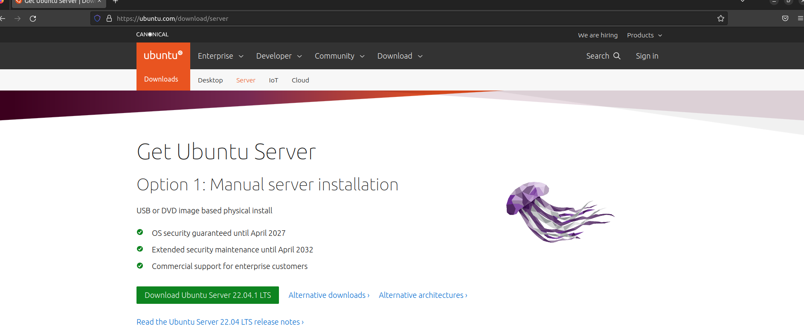
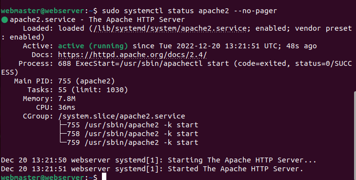
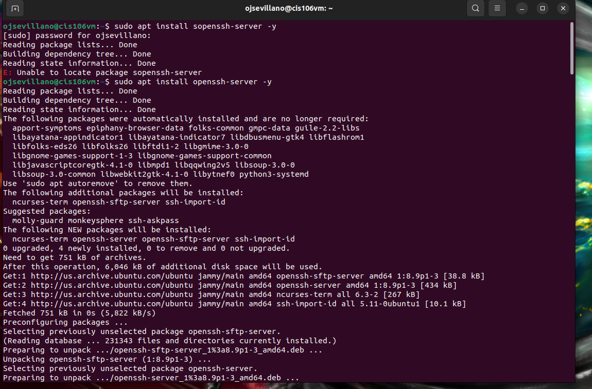
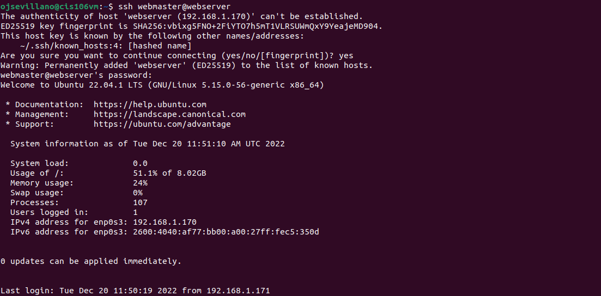
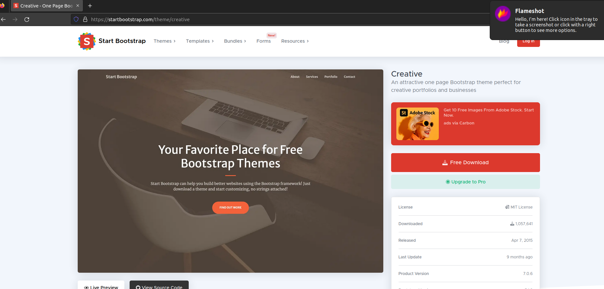
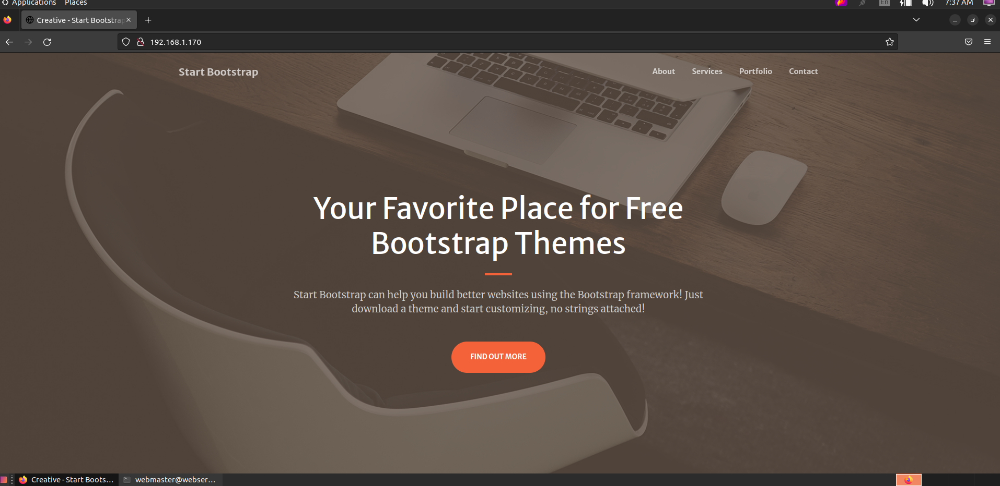

# Deliverable 1
> Tutorial can be found [here](https://www.digitalocean.com/community/tutorials/how-to-install-the-apache-web-server-on-ubuntu-22-04)

## Concepts I don't understand 
* **Apache:** The Apache HTTP server is one of the most widely-used web server in the entire world. Apache is a open-source web server and it's free for everyone. 
  
* **Environment variable:** is a dynamic-named value that can affect the way running processes will behave on a computer. They're part of the environment in which a process runs. 

## What is a web server? Hardware and software side
**A web server:** is a specialized computer system or dedicated server specifically designed to host or deliver websites. A web server can also refer to hardware or software, or both of them working together. 

The hardware side of a web server is a computer that stores web server software and a website's component files. 

* For example: `HTML`, `documents`, `images`, `CSS stylesheets`, and `JavaScript files`. 
  
The hardware side of a web server also connects to the internet and supports physical data interchange with different devices that are connected to the web. 

The software side of a web server includes multiple parts that control how web users access hosted files. 

## What are some different web server applications?

### Lighthttpd 
An area where most web servers fail is resource usage. `Lighthttpd` was designed to overcome these problems in low-memory and low-CPU environments. 
It's built on the asynchronous request handling model. `Lighthttpd` works in a single thread, so if you very good machine, it's going to ignore the other CPU cores. 
`Lighthttpd` is a capable, single threaded web server that can easily handle a few hundred requests per second and go easy on system resources. 

### OpenLiteSpeed
`OpenLiteSpeed` is the open source flavor of the enterprise web server offered by LiteSpeed Technologies. 
* **Reasons to like OpenLiteSpeed:**
  * It's compatible with Apache's `mod_rewrite`, if you have a ton of existing APache files, migrating will be minimal pain. 
  * GUI-based admin interface, offering a pleasant configuration experience.
  * Caching and Google PageSpeedInsights optimizations are applied by default. 

`OpenLiteSpeed` is tuned for PHP performance, PHP-based codebase and projects can benefit immensely. 

## What is virtualization?
**Virtualization:** Is when you install and run multiple operating systems inside a physical machine
Virtualization has two types of hypervisors, there's type 1 where it runs on the hardware.
* Example of type 1: VMware ESX and ESXi.
  
Then there's type 2, where it runs on a host operating system. 
* Example of type 2: Type 2 Example: VMware Workstation Player/Pro

Virtualization also has many benefits: 

1. You're able to run multiple operating systems on a single machine
2. You're able to tryout untested programs without giving the host machine a virus or malware

## What is virtualbox?
Oracle VM **VirtualBox** is a cross-platform virtualization software. It allows user to extend their existing computer to run multiple operating systems including Microsoft Windows, Mac OS X, Linux, and Oracle Solaris, at the same time. 

## What is a virtual machine?
A **virtual machine** is used to operate multiple operating systems and virtual computers on existing hardwares. Virtual machine software can run programs, store data, connect to networks, and also do other computing functions. It also requires maintenance such as updates and system monitoring. 

## What is Ubuntu Server?
**Ubuntu server** is an OS, it's developed by Canonical and open source programmers around the world, that works with nearly any hardware or virtualization platform. It can server up websites, and file shares.
Ubuntu Server can be a very easy way to set up a simple home network. A feature of Ubuntu Server is the ability to assign "super user" tasks to make it easier to administer the network, where using the original edition can be more challenging or labor intensive. 

## What is a firewall?
A **firewall** is a hardware or software that prevents unauthorized access to or from a network. It basically acts like a filter and stops untrusted network traffic or packets. It also protects the network from external attacks. 

## What is SSH?
**SSH**, is also known as "Secure Shell" or "Secure Socket Shell". It's a network protocol that provides users, particularly system administrators, a secure way to access a computer over an unsecured network. 

# Deliverable 2
 
## Installing the Ubuntu Server
* First, we went to ubuntu.com/download/server to download ubuntu server 22.04.

* We then added the following settings to make sure the ubuntu server runs perfectly. 

* Here we have created the first snapshot after the ubuntu server has been installed.

* Here is a picture of the login on the Ubuntu server.

## Installing Apache
* Once we have finished installing the Ubuntu Server.. We login and start installing Apache. 
Once Apache has been installed, we check the status if it's activiated by using the command `sudo systemctl status apache2 --no-pager`. Once the command has been used the following image will show. 

* Once it's all installed we create a snapshot called "Snapshot2 - Apache installed". We do this to save the progress we have done so far. 
  
## Installing SSH
* We first install ssh onto our original virtual machine, so we can login to our web server. 

* Once we do so, we can connect from one computer to another. We first type `ssh username-of-computer@ip address-of-server`. Then type your password. The following should display. 

* To setup a private and public key authentication, we go to the "SSH Guide" on the course website. Then follow the step by step instructions on how to do so. 

## Enabling Virtual Host
* We use mostly all the information used on the digital ocean website, which is under the final project description on the course website. The following picture provides the following steps on how to setup Virtual Hosts.You can also follow the step by step instructions on their website. https://www.digitalocean.com/community/tutorials/how-to-install-the-apache-web-server-on-ubuntu-22-04
  

## The Website
* We enable Virtual Host so we can set up our sample site. 
* We use a free basic site from startbootstrap.com and we grab the files from the site and place them in the web server. 

* Then we login to our web server and copy the url of the basic site from bootstrap and enter this command to the termianl `wget + url of the files`

* Once we do all of that, we go to google and type in our IP Address. The theme we chose from bootstrap should show. Which means our website has been created and functions properly. 

