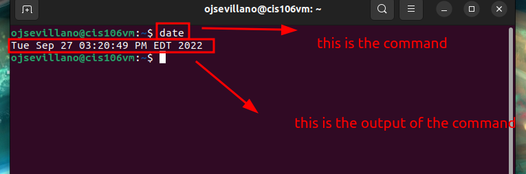

# Lab 3 Submission

## Question 1

## Question 2

## Question 3
 
| Program purpose     | Package Name     | Version                  |
| ------------------- | ---------------- | ------------------------ |
| Play a tetris game  | blockattack      | 2.7.0-1 amd64            |
| Play a video file   | dragonplayer     | 4:21.12.3-0ubuntu1 amd64 |
| Browse the internet | epiphany-browser | 42.4-0ubuntu1 amd64      |
| Read your email     | geary            | 40.0-2 amd64             |
| Play Music          | gmpc             | 11.8.16-19 amd64         |

## Challenge

1. Which command did you use to install?
sudo apt install blockattack dragonplayer epiphany-browser geary gmpc -y

2. Which command did you use to remove?
sudo apt remove blockattack dragonplayer epiphany-browser geary gmpc -y

3. Which command will you use to install and remove?
sudo apt install blockattack+ dragonplayer+ epiphany-browser- geary- gmpc- 

## Question 4

| command | what it does                                           |
| ------- | ------------------------------------------------------ |
| echo    | displays a line of text                                |
| fortune | prints a random adage                                  |
| cowsay  | a thinking cow                                         |
| lolcat  | rainbow coloring effect for text                       |
| figlet  | displays large characters made up of screen characters |
| toilet  | displays large colorful characters                     |
| rig     | random identity generator                              |