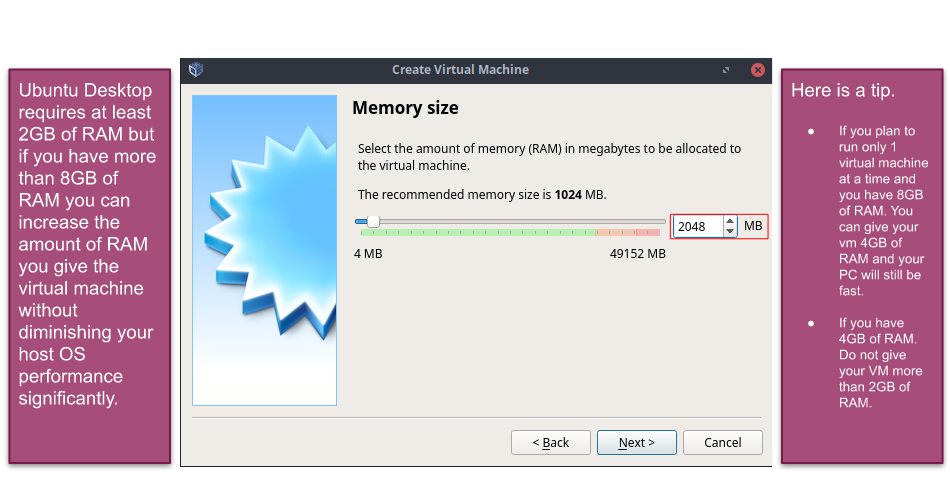
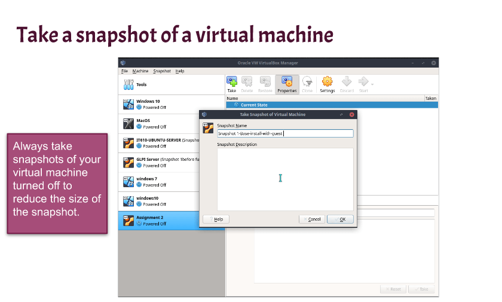

# Week report 2

## The basics of Virtualization 
Virtualization is has two types of hypervisors, there's type 1 where it runs on the hardware. Then there's type 2, where it runs on a host operating system. 
Type 1 Example: VMware ESX and ESXi
Type 2 Example: VMware Workstation Player/Pro

Virtualization also has many benefits. 
1.  You're able to run multiple operating systems on single machine. 
2.  You're able to try out untested programs without giving the host machine a virus or malware. 

In order to have a good experience using virtualization your computer must have the following specifications:
1.  Quad core CPU or Dual core with a base frequency of 2.0GHz
2.  6GB or more of RAM
3.  60GB or more of Free storage
   

**What is virtualization**
Definition of Virtualization: Is when you install and run multiple operating systems inside a physical machine. 

**Types of virtualization** 
* Server-side virtualization
Definition: Server-side virtualization provides a virtual desktop to each user

* Client-side virtualization
Definition: Client-side virtualization is a software that manages virtual machines on your computer. 

## Installing Ubuntu in Virtualbox 
* Confirming virtualization is enabled

* Required RAM for Ubuntu

* Disk Space

* How to Update Ubuntu

* Always take a snapshot

