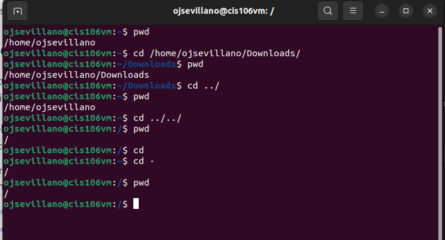
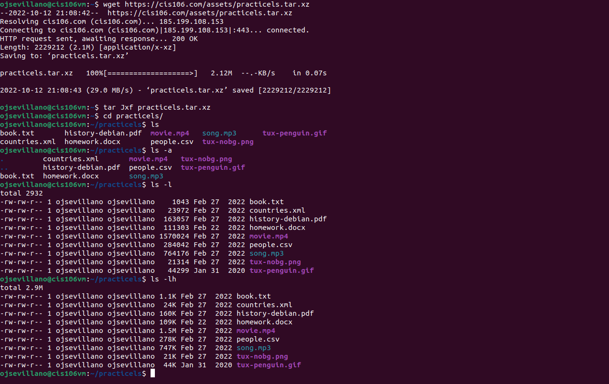
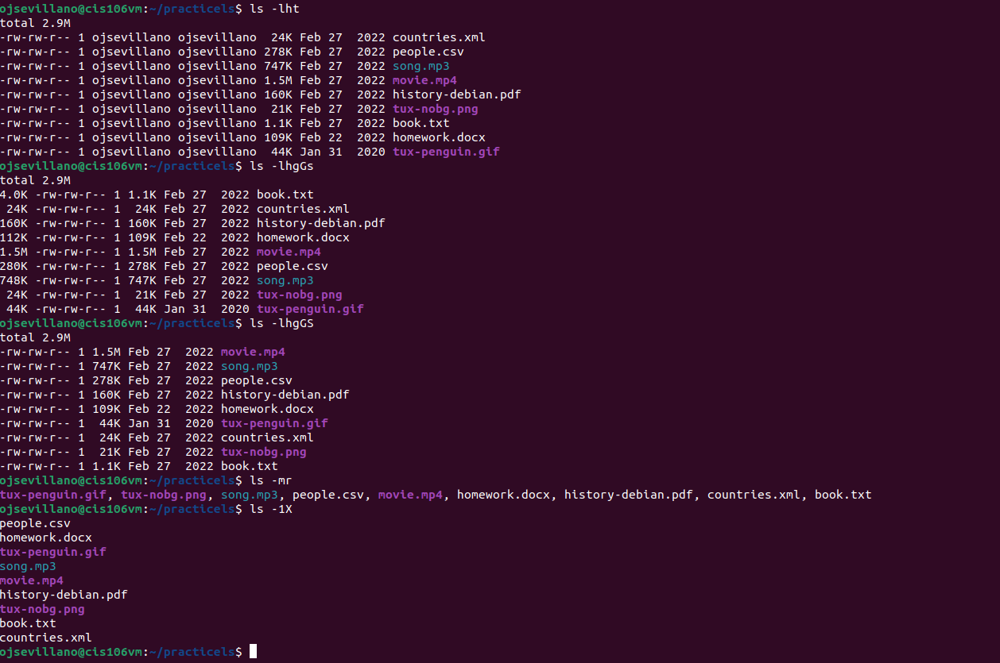

# Week Report 4

## Practice

## The Filesystem Important Directories

| Directory | Data Stored in Directory                                                                          |
| --------- | ------------------------------------------------------------------------------------------------- |
| bin       | essential commands                                                                                |
| dev       | Device files                                                                                      |
| etc       | System configuration files                                                                        |
| home      | User home directories                                                                             |
| media     | Mount point for removable media, like DVDs and floppy disks                                       |
| opt       | Add-on software packages                                                                          |
| proc      | Kernel information, process control, system hardware information                                  |
| srv       | Information relating to services that run on the system                                           |
| usr       | Software not essential for system operation, such as applications                                 |
| var       | Dedicated to variable data, such as logs, databases, files that persist from one boot to the next |

## Commands to navigate the filesystem

| Command | What it does                                               | Syntax | Example |
| ------- | ---------------------------------------------------------- | ------ | ------- |
| pwd     | it displays the current working directory                  | `pwd`  | `pwd`   |
| cd      | changes the current working directory                      | `cd`   | `cd`    |
| ls      | used for displaying all the files inside a given directory | `ls`   | `ls`    |

## Key Terms

Defintions of the following terms: 

* **File system**  - The way files are stored and organized to simplify access to data
  
* **Current directory** - The directory where you are at the moment 
  
* **Parent directory** - Backwards to the previous directory
  
* **The difference between your home directory and the home directory** 
  * Your home directory - refers to your user's home directory. For example, `/home/oswaldo` is the home directory of the user oswaldo
  * The home directory - refers to the home directory located in the root. This: `/home` 
  
* **Pathname** - Indicates the location of the file in the filesystem(like an address)
  
* **Relative path** - The location of a file starting from the current working directory or a directory that is located inside the current working directory
  
* **absolute path** - The location of a file starting a the root of the file system
  
* **A bulleted list of all the commands are used for navigating the filesystem:**
  * pwd
  * cd
  * ls

