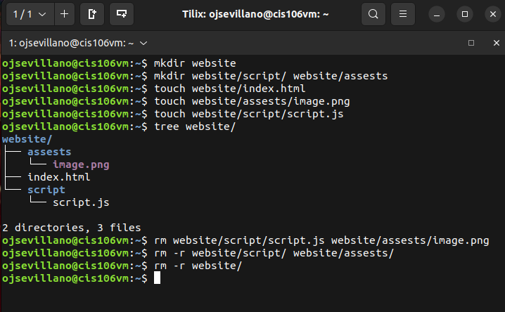
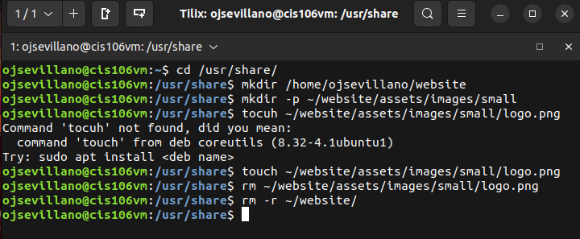
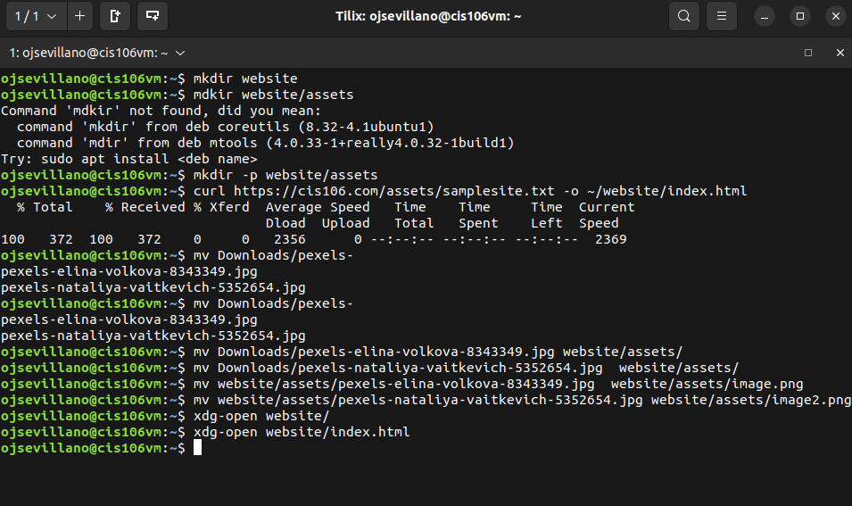
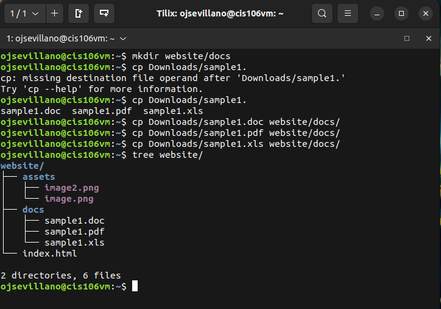

# Week Report 5

## 1. What are Command Options?
Command options modify/enhance their behavior. 

## 2. What are Command Arguments?
Command arguments are the items open which the command acts on.

## 3. Which command is used for creating directories? Provide at least 3 examples.
The command used for creating directories is **mkdir** 
To create a directory with mkdir: `mkdir + the name of the directory` 

### Examples
* To create a directory in the present working directory:  `mkdir wallpapers`
* To create a directory in a different directory using relative path: `mkdir wallpapers/ocean`
* To create a directory in a different directory using absolute path: `mkdir ~/wallpapers/forest` 

## 4. What does the touch command do? Provide at least 3 examples.
The **touch** command is used for creating files. 
To create a file using touch: `touch + file name`

### Examples
* To create a file called list: `touch list`
* To create several files: `touch list_of_cars.txt script.py names.csv`
* To create a file using absolute path: `touch ~/Downloads/games.txt`

## 5. How do you remove a file? Provide an example.
To remove a file, you would use the **rm** command. For example, `rm + file name` 

## 6. How do you remove a directory and can you remove non-empty directories in Linux? Provide an example
To remove a directory use the **rmdir** command. For example, `rmdir Downloads/games`
To remove a non-empty directory use **rm -r** + directory name or directory absolute path. For example, `rm -r Downloads/games`

## 7. Explain the mv and cp command. Provide at least 2 examples of each
The **mv** command moves and renames directories. The basic formula of the **mv** command is: `mv + source + destination` 
The **cp** command copies files/directories from a source to a destination. The cp command uses the same structure as the mv command `cp + files to copy + destination`

### Examples of the mv command
* To move a file from a directory to another using relative path: `mv Downloads/homework.pdf Documents/`
* To rename a file: `mv homework.docx cis106homework.docx`

### Examples of the cp command
* To copy a file: ` cp Downloads/wallpapers.zip Pictures/`
* To copy a directory with absolute path: `cp -r ~/Downloads/wallpapers ~/Pictures/`

## Practice

### Practice 1: 

### Practice 2: 

### Practice 3: 

### Practice 4:
