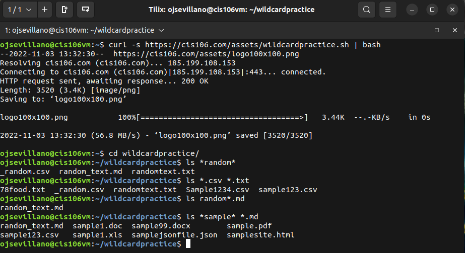
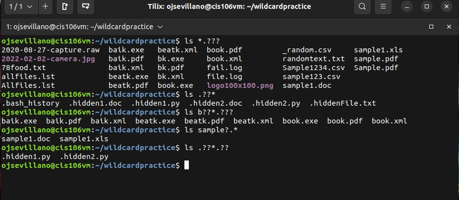
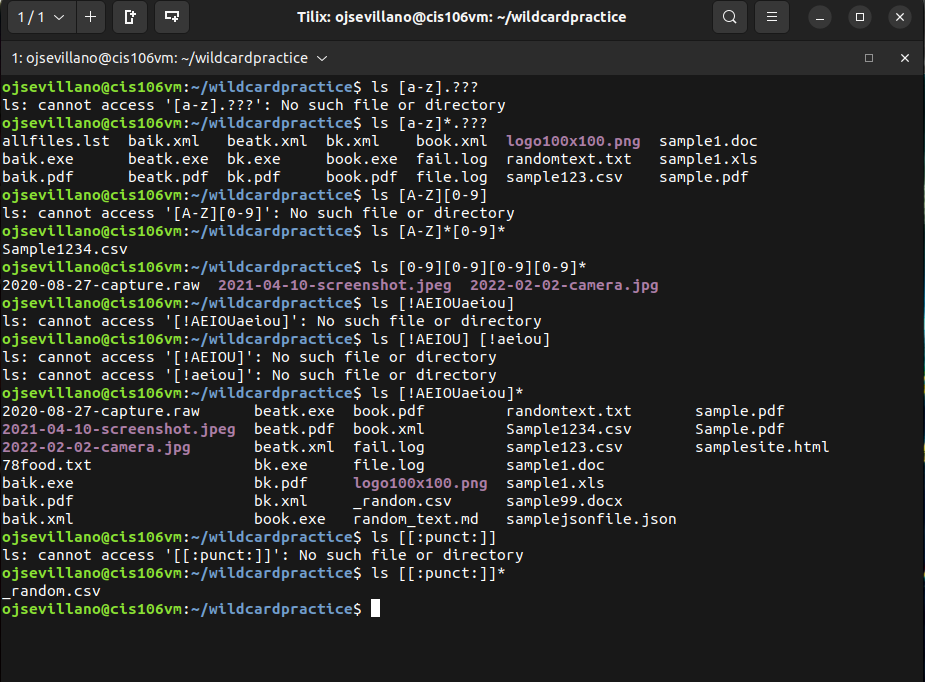

# Week Report 6

## Wildcards. 

### * Wildcard
The * wildcard matches from 0 to any number of characters
* Examples
  * Lists all the files that end in .txt
    * `ls *.txt`
  * Lists all the files that end in .txt and .pdf 
    * `ls *.txt *.pdf`
  * Lists all the files that have any letter before the string "file" and after as well
    * `ls *file.*`

### ? Wildcard
The ? wildcard matches only 1 character
* Examples
  * List all the hidden files in the parent directory
    * `ls ../.??*`
  * List all the files that have a single character between letter f and l
    * `ls f?l*`
  * List all the files that have a 3 letter file extension
    * `ls *.???`
  
### [] Wildcard
The [] wildcard matches 1 character from a set
* Examples
  * To match all files that have a vowel after letter f
    * `ls f[aeiou]*`
  * To match all files whose name begins with any 3 combination of numbers and the current user's username
    * `ls [0-9][0-9][0-9]$USER`
  * To match all files whose name has at least one number
    * `ls *[0-9]*`

### Brace Expansion
Brace Expansion {} is not a wildcard but it's another feature that bash allows you to generate arbitrary strings to use with commands
* Examples
  * To create a whole directory structure in a single command
    * `mkdir -p music/{jazz,rock}/{mp3files,videos,oggfiles}/new{1..3}`
  * To create a N number of files use:
    * `touch website{1..5}.html`
    * `touch file{A..Z}.txt`
  * Remove multiple files in a single directory
    * `rm -r {dir1,dir2,dir3,file.txt,file.py}`
  
## Practice

### Practice 5

### Practice 6

### Practice 7

